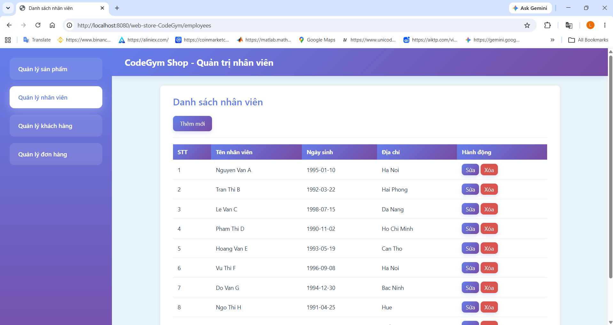
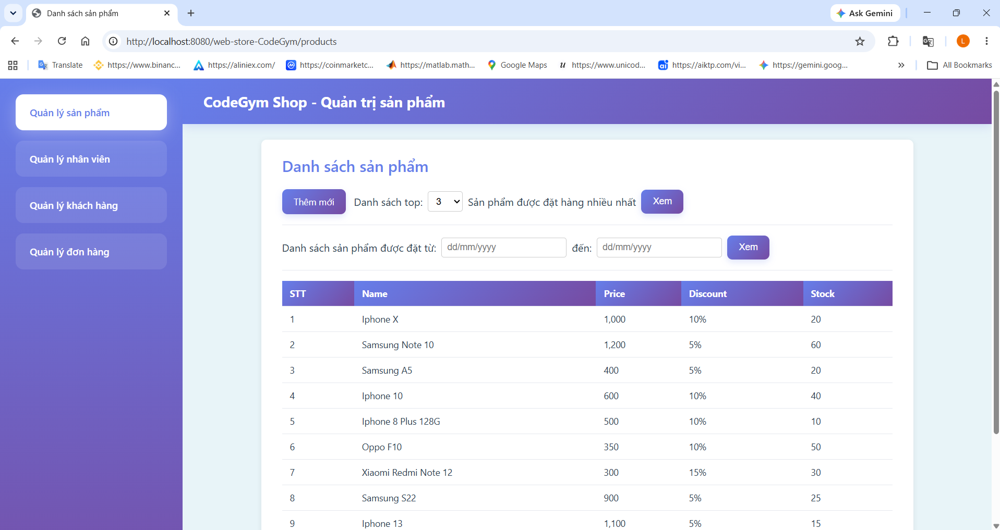
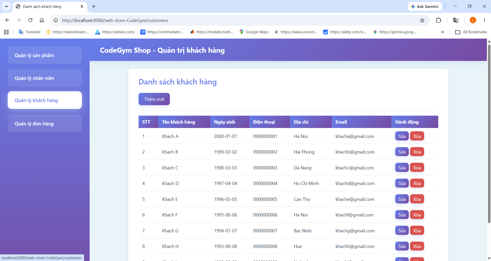
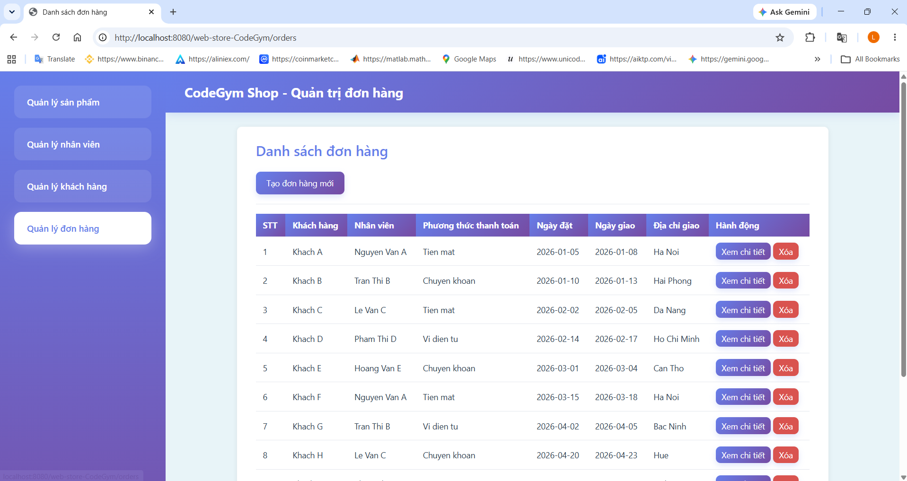

# CodeGym WebShop

Ứng dụng quản lý cửa hàng trực tuyến với chức năng CRUD cho sản phẩm, nhân viên, khách hàng và đơn hàng.

## Cài đặt

### 1. Tạo database
Mở MySQL Command Line Client hoặc MySQL Workbench và chạy file `database.sql`:

### 2. Cấu hình kết nối database
Mở file `main/resources/db.properties` và chỉnh sửa nếu cần:

```properties
db.url=jdbc:mysql://localhost:3306/codegym_shop?useSSL=false&serverTimezone=UTC&allowPublicKeyRetrieval=true
db.username=root
db.password=123456
```

### 3. Cài đặt và chạy với IntelliJ IDEA

1. Mở project trong IntelliJ IDEA
2. Build bằng Maven với file `pom.xml`
3. Cấu hình Tomcat như trong ảnh `screenshots/Tomcat.png` (Dùng SmartTomcat)
4. Run

### 4. Truy cập ứng dụng

Mở trình duyệt và truy cập:
- Trang chủ: `http://localhost:8080/web-store-CodeGym/`
- Quản lý sản phẩm: `http://localhost:8080/web-store-CodeGym/products`
- Quản lý nhân viên: `http://localhost:8080/web-store-CodeGym/employees`
- Quản lý khách hàng: `http://localhost:8080/web-store-CodeGym/customers`
- Quản lý đơn hàng: `http://localhost:8080/web-store-CodeGym/orders`

## Chức năng

- **Quản lý sản phẩm**: Thêm, xem danh sách, top sản phẩm bán chạy, lọc theo ngày
- **Quản lý nhân viên**: Thêm, sửa, xóa nhân viên
- **Quản lý khách hàng**: Thêm, sửa, xóa khách hàng
- **Quản lý đơn hàng**: Tạo đơn hàng, xem chi tiết, xóa đơn hàng

## Giao diện ứng dụng









## Công nghệ

- Java 17+
- Jakarta EE 9+ (Servlet 6.0)
- MySQL 8.0+
- JSP + JSTL
- Maven
- Tomcat 11.0+
